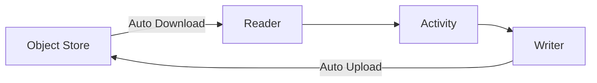

## Overview

The Application SDK provides a powerful I/O system with **Readers** and **Writers** that abstract away the complexity of data storage and retrieval. The system automatically handles object store downloads and uploads, making your code simple and portable.

<Card title="Key Features" icon="sparkles">
  - Automatic object store downloads and uploads
  - Support for Parquet and JSON formats
  - Memory-efficient batched reading and writing
  - Context manager support for automatic cleanup
  - Flexible DataFrame backends (Pandas and Daft)
  - Transparent caching of downloaded files
</Card>

## Architecture

The I/O system follows a clean separation between reading and writing:

<CardGroup cols={2}>
  <Card title="Readers" icon="download">
    Read data from various sources with automatic object store downloads
  </Card>
  <Card title="Writers" icon="upload">
    Write data to various destinations with automatic object store uploads
  </Card>
</CardGroup>

### Data Flow



<Info>
You never need to manually download or upload files - the readers and writers handle it automatically!
</Info>

## Readers

Readers implement a common interface for reading data from various sources.

### Reader Types

<CardGroup cols={2}>
  <Card title="ParquetFileReader" icon="file">
    Read data from Parquet files with automatic download
  </Card>
  <Card title="JsonFileReader" icon="file-code">
    Read data from JSON Lines files with automatic download
  </Card>
</CardGroup>

### ParquetFileReader

Read Parquet files with automatic object store downloads:

```python
from application_sdk.io.parquet import ParquetFileReader
from application_sdk.io import DataframeType
from temporalio import activity

class MyActivities:
    @activity.defn
    async def transform_data(self, workflow_args: dict):
        output_path = workflow_args["output_path"]
        typename = workflow_args.get("typename", "data")
        
        # Path where previous activity wrote files
        input_path = f"{output_path}/raw/{typename}"
        
        # Use context manager for automatic cleanup
        async with ParquetFileReader(
            path=input_path,
            dataframe_type=DataframeType.daft,  # Better for large datasets
            chunk_size=50000  # Process 50K rows at a time
        ) as reader:
            # Read data in batches for memory efficiency
            async for batch_df in reader.read_batches():
                # Process each batch
                transformed = await self.process_batch(batch_df)
                # Write transformed data...
        # Temp files automatically cleaned up here
```

<Tip>
Files are automatically downloaded from object store if they don't exist locally. Downloaded files are cached for subsequent reads.
</Tip>

### JsonFileReader

Read JSON Lines files:

```python
from application_sdk.io.json import JsonFileReader
from application_sdk.io import DataframeType

@activity.defn
async def analyze_logs(self, workflow_args: dict):
    log_path = workflow_args["log_path"]
    
    async with JsonFileReader(
        path=log_path,
        dataframe_type=DataframeType.pandas,  # Good for smaller datasets
        chunk_size=10000
    ) as reader:
        # Read all data at once
        df = await reader.read()
        
        # Analyze the data
        error_count = len(df[df['level'] == 'ERROR'])
        return {"error_count": error_count}
```

### Reader API

<Tabs>
  <Tab title="Context Manager">
    ```python
    # Recommended: Use async with for automatic cleanup
    async with ParquetFileReader(path="/data/input") as reader:
        df = await reader.read()
        # Process data
    # close() called automatically, temp files cleaned up
    ```
  </Tab>
  
  <Tab title="Manual Management">
    ```python
    # Manual cleanup (not recommended)
    reader = ParquetFileReader(path="/data/input")
    try:
        df = await reader.read()
        # Process data
    finally:
        await reader.close()  # Must call close() manually
    ```
  </Tab>
  
  <Tab title="Batched Reading">
    ```python
    # Memory-efficient batched reading
    async with ParquetFileReader(
        path="/data/large_dataset",
        chunk_size=100000
    ) as reader:
        async for batch in reader.read_batches():
            # Process each batch independently
            await process_batch(batch)
    ```
  </Tab>
</Tabs>

### Reader Parameters

<ParamField path="path" type="str" required>
  Local path where files are or should be downloaded to
</ParamField>

<ParamField path="file_names" type="list[str]" optional>
  Specific files to read. If not provided, reads all files in the directory
</ParamField>

<ParamField path="chunk_size" type="int" default="100000">
  Number of rows per batch when using `read_batches()`
</ParamField>

<ParamField path="dataframe_type" type="DataframeType" default="pandas">
  DataFrame backend: `DataframeType.pandas` or `DataframeType.daft`
</ParamField>

<ParamField path="cleanup_on_close" type="bool" default="true">
  Whether to delete downloaded files when the reader is closed
</ParamField>

### DataFrame Type Selection

<CardGroup cols={2}>
  <Card title="Pandas" icon="table">
    **Best for:**
    - Small to medium datasets (< 1GB)
    - Rich API and ecosystem
    - Complex transformations
    - Data analysis and exploration
    
    ```python
    DataframeType.pandas
    ```
  </Card>
  
  <Card title="Daft" icon="layer-group">
    **Best for:**
    - Large datasets (> 1GB)
    - Distributed processing
    - Memory efficiency
    - Parallel operations
    
    ```python
    DataframeType.daft
    ```
  </Card>
</CardGroup>

## Writers

Writers implement a common interface for writing data to various destinations.

### Writer Types

<CardGroup cols={2}>
  <Card title="ParquetFileWriter" icon="file">
    Write data to Parquet files with automatic upload
  </Card>
  <Card title="JsonFileWriter" icon="file-code">
    Write data to JSON Lines files with automatic upload
  </Card>
</CardGroup>

### ParquetFileWriter

Write Parquet files with automatic object store uploads:

```python
from application_sdk.io.parquet import ParquetFileWriter
import pandas as pd

@activity.defn
async def extract_data(self, workflow_args: dict):
    output_path = workflow_args["output_path"]
    typename = "users"
    
    # Create writer
    async with ParquetFileWriter(
        path=f"{output_path}/raw/{typename}",
        typename=typename,
        chunk_size=50000  # Split into 50K record files
    ) as writer:
        # Fetch data from source
        async for batch in self.fetch_users_batched():
            df = pd.DataFrame(batch)
            await writer.write(df)
        
        # Get statistics
        stats = writer.statistics
        return {
            "total_records": stats.total_record_count,
            "chunks": stats.chunk_count
        }
    # Files automatically uploaded to object store here
```

<Info>
Files are written locally first, then automatically uploaded to object store when the writer is closed.
</Info>

### JsonFileWriter

Write JSON Lines files:

```python
from application_sdk.io.json import JsonFileWriter

@activity.defn
async def export_results(self, workflow_args: dict):
    output_path = workflow_args["output_path"]
    
    async with JsonFileWriter(
        path=f"{output_path}/results",
        typename="analysis",
        chunk_size=10000
    ) as writer:
        # Write DataFrame
        await writer.write(results_df)
        
        # Write dict directly
        await writer.write({"summary": "Analysis complete"})
        
        # Write list of dicts
        await writer.write([
            {"id": 1, "value": 100},
            {"id": 2, "value": 200}
        ])
        
        # Get statistics
        stats = writer.statistics
        return stats.model_dump()
```

### Writer API

<Tabs>
  <Tab title="Context Manager">
    ```python
    # Recommended: Use async with
    async with JsonFileWriter(path="/data/output") as writer:
        await writer.write(dataframe)
        await writer.write({"key": "value"})
    # close() called automatically, files uploaded
    ```
  </Tab>
  
  <Tab title="Manual Management">
    ```python
    # Manual management
    writer = JsonFileWriter(path="/data/output")
    try:
        await writer.write(dataframe)
        stats = await writer.close()  # Returns statistics
    except Exception as e:
        logger.error(f"Write failed: {e}")
        raise
    ```
  </Tab>
  
  <Tab title="Batched Writing">
    ```python
    # Write data in batches
    async with ParquetFileWriter(path="/data/output") as writer:
        async for batch in fetch_data_batches():
            await writer.write(batch)
            # Each batch written incrementally
    ```
  </Tab>
</Tabs>

### Writer Parameters

<ParamField path="path" type="str" required>
  Full path where files will be written (e.g., `/data/workflow_run_123/transformed`)
</ParamField>

<ParamField path="typename" type="str" optional>
  Subdirectory name under path for organizing output (e.g., `tables`, `columns`)
</ParamField>

<ParamField path="chunk_start" type="int" optional>
  Starting index for chunk numbering in filenames
</ParamField>

<ParamField path="chunk_size" type="int" default="50000">
  Maximum number of records per output file chunk
</ParamField>

<ParamField path="chunk_part" type="int" optional>
  Part number for file naming (useful for parallel writes)
</ParamField>

### Writer Output

Writers automatically create organized output:

```bash
/data/workflow_run_123/
├── raw/
│   ├── tables/
│   │   ├── 1.parquet
│   │   ├── 2-50000.parquet
│   │   ├── 50001-100000.parquet
│   │   └── statistics.json.ignore
│   └── columns/
│       ├── 1.json
│       └── statistics.json.ignore
└── transformed/
    ├── enriched_tables/
    │   ├── 1.parquet
    │   └── statistics.json.ignore
```

<Tip>
`.ignore` files contain metadata but are not uploaded to object store.
</Tip>

## Object Store Integration

### How It Works

The SDK provides transparent object store integration:

<Steps>
  <Step title="Write Locally">
    Writer writes files to local filesystem first
  </Step>
  <Step title="Auto-Upload">
    On `close()`, files are automatically uploaded to object store
  </Step>
  <Step title="Optional Cleanup">
    Local files can be retained or deleted after upload
  </Step>
</Steps>

For reading:

<Steps>
  <Step title="Check Local">
    Reader checks if files exist locally
  </Step>
  <Step title="Auto-Download">
    If not found, automatically downloads from object store
  </Step>
  <Step title="Cache Locally">
    Downloads are cached for subsequent reads
  </Step>
  <Step title="Cleanup">
    Downloaded files cleaned up on `close()` (if enabled)
  </Step>
</Steps>

### Path Normalization

The SDK automatically normalizes paths for object store operations:

```python
# Both of these are equivalent
path1 = "./local/tmp/artifacts/apps/my-app/workflows/wf-123/run-456"
path2 = "artifacts/apps/my-app/workflows/wf-123/run-456"

# Both normalize to: artifacts/apps/my-app/workflows/wf-123/run-456
```

<Info>
See [Output Paths](/advanced/output-paths) for details on path structure and conventions.
</Info>

## Advanced Patterns

### File Filtering

Read only specific files from a directory:

```python
async with ParquetFileReader(
    path="/data/partitioned",
    file_names=[
        "chunk-0-0.parquet",
        "chunk-0-1.parquet",
        "chunk-0-2.parquet"
    ]
) as reader:
    df = await reader.read()
```

### Multi-Stage Pipeline

Chain readers and writers for data pipelines:

```python
@activity.defn
async def multi_stage_pipeline(self, workflow_args: dict):
    output_path = workflow_args["output_path"]
    
    # Stage 1: Read raw data
    async with JsonFileReader(
        path=f"{output_path}/raw/data"
    ) as reader:
        raw_df = await reader.read()
    
    # Stage 2: Transform
    transformed_df = await self.transform(raw_df)
    
    # Stage 3: Write transformed data
    async with ParquetFileWriter(
        path=f"{output_path}/transformed/data",
        typename="enriched"
    ) as writer:
        await writer.write(transformed_df)
        return writer.statistics.model_dump()
```

### Parallel Processing

Process large datasets in parallel:

```python
import asyncio

@activity.defn
async def parallel_processing(self, workflow_args: dict):
    input_path = workflow_args["input_path"]
    output_path = workflow_args["output_path"]
    
    async with ParquetFileReader(
        path=input_path,
        chunk_size=10000
    ) as reader:
        # Process batches in parallel (with concurrency limit)
        async def process_batch(batch_num, batch_df):
            processed = await self.process(batch_df)
            
            # Write each batch to separate file
            async with ParquetFileWriter(
                path=output_path,
                chunk_part=batch_num
            ) as writer:
                await writer.write(processed)
        
        # Create tasks for parallel processing
        tasks = []
        async for idx, batch in enumerate(reader.read_batches()):
            tasks.append(process_batch(idx, batch))
            
            # Limit concurrency to 5 batches at a time
            if len(tasks) >= 5:
                await asyncio.gather(*tasks)
                tasks = []
        
        # Process remaining batches
        if tasks:
            await asyncio.gather(*tasks)
```

### Conditional Cleanup

Control when downloaded files are cleaned up:

```python
# Keep downloaded files for debugging
async with ParquetFileReader(
    path=input_path,
    cleanup_on_close=False  # Don't delete on close
) as reader:
    df = await reader.read()
    # Files remain after this block

# Later, manually clean up if needed
import shutil
shutil.rmtree(input_path)
```

### Retry on Failure

```python
async def write_with_retry(
    data: pd.DataFrame,
    output_path: str,
    max_retries: int = 3
):
    """Write data with retry logic."""
    for attempt in range(max_retries):
        try:
            async with ParquetFileWriter(path=output_path) as writer:
                await writer.write(data)
                return writer.statistics
        except Exception as e:
            if attempt < max_retries - 1:
                logger.warning(
                    f"Write attempt {attempt + 1} failed: {e}. Retrying..."
                )
                await asyncio.sleep(2 ** attempt)  # Exponential backoff
            else:
                logger.error(f"Write failed after {max_retries} attempts")
                raise
```

## Best Practices

<CardGroup cols={2}>
  <Card title="Use Context Managers" icon="brackets-curly">
    Always use `async with` for automatic cleanup and resource management
  </Card>
  
  <Card title="Batch Large Datasets" icon="layer-group">
    Use `read_batches()` and `write()` in loops for memory efficiency
  </Card>
  
  <Card title="Choose Right DataFrame" icon="table">
    Pandas for small data, Daft for large distributed processing
  </Card>
  
  <Card title="Monitor Statistics" icon="chart-line">
    Use writer statistics to track record counts and chunks
  </Card>
  
  <Card title="Handle Errors" icon="shield-halved">
    Implement retry logic for network and storage failures
  </Card>
  
  <Card title="Organize Output" icon="folder-tree">
    Use `typename` parameter to organize different data types
  </Card>
</CardGroup>

### Performance Tips

<AccordionGroup>
  <Accordion title="Chunk Size Tuning">
    Adjust chunk size based on your data:
    
    ```python
    # Small records (< 1KB each): Larger chunks
    chunk_size = 100000
    
    # Medium records (1-10KB): Default chunks
    chunk_size = 50000
    
    # Large records (> 10KB): Smaller chunks
    chunk_size = 10000
    ```
  </Accordion>
  
  <Accordion title="Minimize Downloads">
    Cache downloaded files when processing in multiple stages:
    
    ```python
    # Stage 1: Download and keep files
    async with ParquetFileReader(
        path=input_path,
        cleanup_on_close=False
    ) as reader:
        df = await reader.read()
    
    # Stage 2: Reuse cached files
    async with ParquetFileReader(path=input_path) as reader:
        df2 = await reader.read()  # No download needed
    ```
  </Accordion>
  
  <Accordion title="Parallel Writes">
    Write to different paths in parallel:
    
    ```python
    async def write_multiple(
        tables_df: pd.DataFrame,
        columns_df: pd.DataFrame,
        output_path: str
    ):
        # Write tables and columns in parallel
        await asyncio.gather(
            write_data(tables_df, f"{output_path}/tables"),
            write_data(columns_df, f"{output_path}/columns")
        )
    ```
  </Accordion>
</AccordionGroup>

## Troubleshooting

<AccordionGroup>
  <Accordion title="Files Not Found">
    If reader can't find files:
    1. Check the path is correct
    2. Verify files exist in object store
    3. Check object store configuration
    4. Enable debug logging to see download attempts
    
    ```python
    import logging
    logging.getLogger("application_sdk.io").setLevel(logging.DEBUG)
    ```
  </Accordion>
  
  <Accordion title="Upload Failures">
    If writer fails to upload:
    1. Check object store credentials
    2. Verify network connectivity
    3. Check object store permissions
    4. Look for error logs in writer output
  </Accordion>
  
  <Accordion title="Memory Issues">
    If running out of memory:
    1. Use `read_batches()` instead of `read()`
    2. Reduce chunk size
    3. Use Daft instead of Pandas
    4. Process data in smaller batches
  </Accordion>
</AccordionGroup>

## Related Topics

<CardGroup cols={2}>
  <Card title="Output Paths" icon="route" href="/advanced/output-paths">
    Path structure and organization
  </Card>
  <Card title="Activities" icon="bolt" href="/core/activities">
    Using I/O in activities
  </Card>
  <Card title="Object Store" icon="cloud" href="/services/objectstore">
    Direct object store operations
  </Card>
  <Card title="State Store" icon="database" href="/services/statestore">
    Persistent state management
  </Card>
</CardGroup>