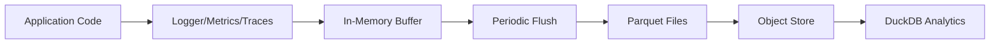

## Overview

The Application SDK provides a complete observability stack built on three pillars:

<CardGroup cols={3}>
  <Card title="Logs" icon="file-lines">
    Structured logging with automatic buffering and Parquet storage
  </Card>
  <Card title="Metrics" icon="gauge">
    Counters, gauges, and histograms with Prometheus integration
  </Card>
  <Card title="Traces" icon="route">
    Distributed tracing for workflow and activity execution
  </Card>
</CardGroup>

## Temporal Prometheus Metrics

Every application using `TemporalWorkflowClient` automatically exposes ~40 built-in Temporal SDK metrics at startup.

<Note>
No code changes required - metrics are automatically exposed when you call `client.load()`
</Note>

### Metrics Endpoint

```bash
http://<host>:9464/metrics
```

Default bind address: `0.0.0.0:9464` (OpenTelemetry convention)

<Tip>
Override the bind address with the `ATLAN_TEMPORAL_PROMETHEUS_BIND_ADDRESS` environment variable:
```bash
ATLAN_TEMPORAL_PROMETHEUS_BIND_ADDRESS=0.0.0.0:9464
```
</Tip>

### Key Metrics

<AccordionGroup>
  <Accordion title="Activity Metrics">
    | Metric | Type | Description |
    |--------|------|-------------|
    | `temporal_activity_execution_latency` | Histogram | Activity execution duration |
    | `temporal_activity_schedule_to_start_latency` | Histogram | Time from schedule to start |
    | `temporal_activity_execution_failed` | Counter | Failed activity executions |
    | `temporal_activity_execution_canceled` | Counter | Canceled activities |
    
    **Example PromQL Query:**
    ```promql
    # 95th percentile activity latency
    histogram_quantile(0.95, 
      rate(temporal_activity_execution_latency_bucket[5m])
    )
    ```
  </Accordion>
  
  <Accordion title="Workflow Metrics">
    | Metric | Type | Description |
    |--------|------|-------------|
    | `temporal_workflow_completed` | Counter | Total completed workflows |
    | `temporal_workflow_failed` | Counter | Total failed workflows |
    | `temporal_workflow_endtoend_latency` | Histogram | End-to-end workflow duration |
    | `temporal_workflow_task_execution_latency` | Histogram | Workflow task execution time |
    
    **Example PromQL Query:**
    ```promql
    # Workflow failure rate
    rate(temporal_workflow_failed[5m]) / 
    rate(temporal_workflow_completed[5m])
    ```
  </Accordion>
  
  <Accordion title="Worker Metrics">
    | Metric | Type | Description |
    |--------|------|-------------|
    | `temporal_worker_task_slots_available` | Gauge | Available worker task slots |
    | `temporal_worker_task_slots_used` | Gauge | In-use worker task slots |
    | `temporal_sticky_cache_hit` | Counter | Sticky cache hits |
    | `temporal_sticky_cache_size` | Gauge | Current sticky cache size |
    
    **Example Alert:**
    ```yaml
    - alert: WorkerSlotsExhausted
      expr: temporal_worker_task_slots_available == 0
      for: 5m
      annotations:
        summary: "Worker has no available task slots"
    ```
  </Accordion>
  
  <Accordion title="gRPC Metrics">
    | Metric | Type | Description |
    |--------|------|-------------|
    | `temporal_request_latency` | Histogram | gRPC request latency to Temporal server |
    | `temporal_request_failure` | Counter | gRPC request failures |
    | `temporal_long_request` | Counter | Long-running requests |
    | `temporal_long_request_latency` | Histogram | Long request durations |
    
    **Example Dashboard:**
    ```promql
    # Server connectivity health
    rate(temporal_request_failure[5m]) > 0
    ```
  </Accordion>
</AccordionGroup>

### Prometheus Configuration

<Tabs>
  <Tab title="Prometheus">
    Add to your `prometheus.yml`:
    
    ```yaml prometheus.yml
    scrape_configs:
      - job_name: 'temporal-sdk'
        scrape_interval: 15s
        static_configs:
          - targets:
              - 'app-host:9464'
            labels:
              application: 'my-app'
              environment: 'production'
    ```
  </Tab>
  
  <Tab title="Kubernetes">
    Using Prometheus Operator:
    
    ```yaml servicemonitor.yaml
    apiVersion: monitoring.coreos.com/v1
    kind: ServiceMonitor
    metadata:
      name: temporal-sdk-metrics
      namespace: monitoring
    spec:
      selector:
        matchLabels:
          app: my-application
      endpoints:
        - port: temporal-metrics
          path: /metrics
          interval: 15s
    ```
    
    Update your Service:
    ```yaml service.yaml
    apiVersion: v1
    kind: Service
    metadata:
      name: my-application
      labels:
        app: my-application
    spec:
      ports:
        - name: temporal-metrics
          port: 9464
          targetPort: 9464
      selector:
        app: my-application
    ```
  </Tab>
  
  <Tab title="Docker Compose">
    ```yaml docker-compose.yml
    services:
      my-app:
        image: my-app:latest
        ports:
          - "9464:9464"
        environment:
          - ATLAN_TEMPORAL_PROMETHEUS_BIND_ADDRESS=0.0.0.0:9464
      
      prometheus:
        image: prom/prometheus:latest
        ports:
          - "9090:9090"
        volumes:
          - ./prometheus.yml:/etc/prometheus/prometheus.yml
        command:
          - '--config.file=/etc/prometheus/prometheus.yml'
    ```
  </Tab>
</Tabs>

### Singleton Runtime

<Info>
The Temporal `Runtime` that binds the metrics port is a **process-level singleton**. Multiple client instances or repeated `load()` calls within the same process reuse the same Runtime - the port is bound exactly once per process.
</Info>

```python
from application_sdk.clients.temporal import TemporalWorkflowClient

# First client binds port 9464
client1 = TemporalWorkflowClient(application_name="app1")
await client1.load()  # Port 9464 bound here

# Second client reuses the same Runtime
client2 = TemporalWorkflowClient(application_name="app2")
await client2.load()  # No additional port binding
```

## Application Observability

Beyond Temporal metrics, the SDK provides a comprehensive observability system for your application code.

### Architecture

The observability system uses a buffered, partitioned Parquet storage architecture:



<CardGroup cols={2}>
  <Card title="Buffered Collection" icon="database">
    Records are buffered in memory for performance
  </Card>
  <Card title="Hive Partitioning" icon="folder-tree">
    Data organized by year/month/day for efficient queries
  </Card>
  <Card title="Auto-Upload" icon="cloud-arrow-up">
    Automatic upload to object store (S3, Azure, GCS)
  </Card>
  <Card title="DuckDB UI" icon="table">
    Built-in analytics with SQL interface
  </Card>
</CardGroup>

### The @observability Decorator

Automate observability for any function:

```python application_sdk/observability/decorators/observability_decorator.py
from application_sdk.observability.decorators import observability

class MyActivities:
    @observability()
    async def process_data(self, data_id: str) -> dict:
        """Process data with automatic observability.
        
        This decorator automatically:
        - Logs function entry/exit
        - Records success/failure metrics
        - Creates distributed traces
        - Tracks execution duration
        """
        result = await self.fetch_and_process(data_id)
        return result
```

<Info>
The decorator auto-initializes logger, metrics, and traces if not provided. Simply use `@observability()` with no arguments.
</Info>

### What Gets Recorded

<Tabs>
  <Tab title="Traces">
    Distributed traces with span information:
    
    ```python
    traces.record_trace(
        name="process_data",
        trace_id="uuid-...",
        span_id="uuid-...",
        kind="INTERNAL",
        status_code="OK",  # or "ERROR"
        attributes={
            "function": "process_data",
            "description": "Process data with...",
            "module": "my_activities"
        },
        events=[
            {
                "name": "process_data_success",
                "timestamp": 1234567890.123
            }
        ],
        duration_ms=125.5
    )
    ```
  </Tab>
  
  <Tab title="Metrics">
    Success and failure counters:
    
    ```python
    # On success
    metrics.record_metric(
        name="process_data_success",
        value=1,
        metric_type=MetricType.COUNTER,
        labels={"function": "process_data"},
        description="Successful process_data",
        unit="count"
    )
    
    # On failure
    metrics.record_metric(
        name="process_data_failure",
        value=1,
        metric_type=MetricType.COUNTER,
        labels={
            "function": "process_data",
            "error": "ConnectionError"
        },
        description="Failed process_data",
        unit="count"
    )
    ```
  </Tab>
  
  <Tab title="Logs">
    Structured log entries:
    
    ```python
    # Entry
    logger.debug("Starting async function process_data")
    
    # Success
    logger.debug("Completed function process_data in 125.50ms")
    
    # Failure
    logger.error("Error in function process_data: ConnectionError")
    ```
  </Tab>
</Tabs>

### Manual Observability

For fine-grained control, use the adapters directly:

```python
from application_sdk.observability.logger_adaptor import get_logger
from application_sdk.observability.metrics_adaptor import get_metrics, MetricType
from application_sdk.observability.traces_adaptor import get_traces

logger = get_logger(__name__)
metrics = get_metrics()
traces = get_traces()

class MyActivities:
    async def complex_operation(self, params: dict):
        trace_id = str(uuid.uuid4())
        span_id = str(uuid.uuid4())
        start_time = time.time()
        
        logger.info("Starting complex operation", extra={"params": params})
        
        try:
            # Your operation
            result = await self.do_work(params)
            
            # Record success
            duration_ms = (time.time() - start_time) * 1000
            traces.record_trace(
                name="complex_operation",
                trace_id=trace_id,
                span_id=span_id,
                status_code="OK",
                duration_ms=duration_ms
            )
            
            metrics.record_metric(
                name="operation_duration",
                value=duration_ms,
                metric_type=MetricType.HISTOGRAM,
                labels={"operation": "complex_operation"}
            )
            
            return result
            
        except Exception as e:
            logger.error(f"Operation failed: {e}", exc_info=True)
            metrics.record_metric(
                name="operation_errors",
                value=1,
                metric_type=MetricType.COUNTER,
                labels={"operation": "complex_operation", "error_type": type(e).__name__}
            )
            raise
```

## Storage and Partitioning

### Hive-Style Partitioning

Data is automatically organized in Hive-style partitions:

```bash
./local/dapr/observability/
├── logs/
│   ├── year=2024/
│   │   ├── month=03/
│   │   │   ├── day=01/
│   │   │   │   └── data.parquet
│   │   │   ├── day=02/
│   │   │   │   └── data.parquet
├── metrics/
│   ├── year=2024/
│   │   ├── month=03/
│   │   │   ├── day=01/
│   │   │   │   └── data.parquet
├── traces/
│   ├── year=2024/
│   │   ├── month=03/
│   │   │   ├── day=01/
│   │   │   │   └── data.parquet
```

<Tip>
Partitioning enables efficient queries: "Show me all logs from March 1st" only reads that day's files.
</Tip>

### Configuration

```python application_sdk/observability/observability.py
class AtlanObservability:
    def __init__(
        self,
        batch_size: int = 100,           # Records per flush
        flush_interval: int = 60,         # Seconds between flushes
        retention_days: int = 30,         # Days to keep data
        cleanup_enabled: bool = True,     # Auto-cleanup old data
        data_dir: str = "./observability",
        file_name: str = "logs"
    ):
        ...
```

### Data Flow

<Steps>
  <Step title="Buffer">
    Records accumulate in memory (default: 100 records or 60 seconds)
  </Step>
  <Step title="Flush">
    Buffer is written to Parquet files in partitioned directories
  </Step>
  <Step title="Upload">
    Files are uploaded to configured object store (S3, Azure, GCS)
  </Step>
  <Step title="Cleanup">
    Old partitions are removed based on retention policy
  </Step>
</Steps>

## DuckDB Analytics

The SDK includes a built-in DuckDB UI for analyzing observability data:

```python
from application_sdk.observability.observability import DuckDBUI

ui = DuckDBUI()
ui.start_ui()  # Starts on http://0.0.0.0:4213
```

<Info>
The UI automatically creates views for logs, metrics, and traces with Hive partitioning support.
</Info>

### Example Queries

<CodeGroup>
```sql Logs
-- Recent errors
SELECT timestamp, message, file, line
FROM logs
WHERE level = 'ERROR'
  AND year = 2024
  AND month = 3
  AND day = 1
ORDER BY timestamp DESC
LIMIT 10;
```

```sql Metrics
-- Top operations by count
SELECT 
  labels['function'] as function,
  COUNT(*) as count,
  AVG(value) as avg_value
FROM metrics
WHERE type = 'counter'
  AND year = 2024
  AND month = 3
GROUP BY function
ORDER BY count DESC;
```

```sql Traces
-- Slowest traces
SELECT 
  name,
  duration_ms,
  status_code,
  attributes
FROM traces
WHERE year = 2024
  AND month = 3
  AND day = 1
ORDER BY duration_ms DESC
LIMIT 10;
```
</CodeGroup>

## Recommended Alerts

<AccordionGroup>
  <Accordion title="High Activity Failure Rate">
    ```yaml
    - alert: HighActivityFailureRate
      expr: |
        rate(temporal_activity_execution_failed[5m]) > 0.05
      for: 10m
      labels:
        severity: warning
      annotations:
        summary: "Activity failure rate is above 5%"
        description: "{{ $value | humanizePercentage }} of activities are failing"
    ```
  </Accordion>
  
  <Accordion title="Worker Slots Exhausted">
    ```yaml
    - alert: WorkerSlotsExhausted
      expr: temporal_worker_task_slots_available == 0
      for: 5m
      labels:
        severity: critical
      annotations:
        summary: "Worker has no available task slots"
        description: "All worker slots are in use, tasks may be delayed"
    ```
  </Accordion>
  
  <Accordion title="Elevated Workflow Latency">
    ```yaml
    - alert: HighWorkflowLatency
      expr: |
        histogram_quantile(0.99, 
          rate(temporal_workflow_endtoend_latency_bucket[5m])
        ) > 300
      for: 10m
      labels:
        severity: warning
      annotations:
        summary: "P99 workflow latency is above 300s"
    ```
  </Accordion>
  
  <Accordion title="Temporal Server Errors">
    ```yaml
    - alert: TemporalServerErrors
      expr: rate(temporal_request_failure[5m]) > 0
      for: 5m
      labels:
        severity: warning
      annotations:
        summary: "Temporal server is returning errors"
        description: "{{ $value }} errors per second"
    ```
  </Accordion>
</AccordionGroup>

## Best Practices

<CardGroup cols={2}>
  <Card title="Use the Decorator" icon="magic-wand-sparkles">
    Apply `@observability()` to all important functions for automatic instrumentation
  </Card>
  <Card title="Structured Logging" icon="list">
    Use the `extra` parameter for structured log data instead of string formatting
  </Card>
  <Card title="Meaningful Labels" icon="tags">
    Add descriptive labels to metrics for better filtering and aggregation
  </Card>
  <Card title="Monitor Dashboards" icon="dashboard">
    Create Grafana dashboards for real-time monitoring of key metrics
  </Card>
</CardGroup>

## Related Topics

<CardGroup cols={2}>
  <Card title="Temporal Auth" icon="lock" href="/advanced/temporal-auth">
    Secure your Temporal connections
  </Card>
  <Card title="MCP Integration" icon="plug" href="/advanced/mcp-integration">
    Monitor MCP tool usage
  </Card>
  <Card title="Workflows" icon="diagram-project" href="/core/workflows">
    Workflow execution patterns
  </Card>
  <Card title="Activities" icon="bolt" href="/core/activities">
    Activity implementation guide
  </Card>
</CardGroup>