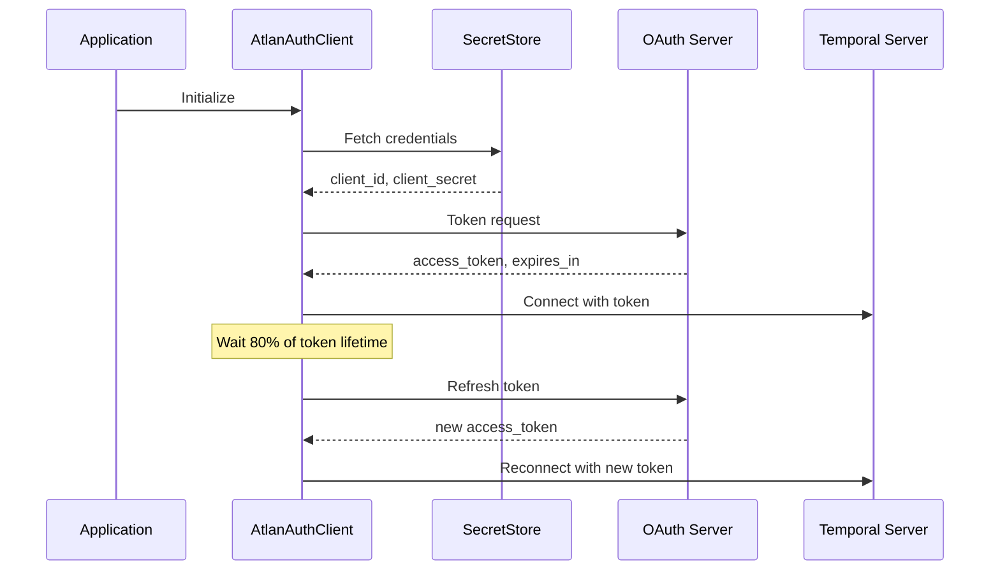

## Overview

The Application SDK provides a robust **OAuth2-based authentication system** for Temporal workers using the client credentials flow. This system enables secure communication between your application and the Temporal server with automatic credential discovery and token management.

<Card title="Key Features" icon="star">
  - Dynamic token management with intelligent refresh
  - Smart credential discovery from secret stores
  - Production-ready security best practices
  - Automatic token refresh at 80% of token lifetime
  - Support for credential rotation without restart
</Card>

## Authentication Components

<CardGroup cols={3}>
  <Card title="AtlanAuthClient" icon="key">
    Core OAuth2 token manager with automatic refresh
  </Card>
  <Card title="SecretStore" icon="vault">
    Dapr-based secret discovery and retrieval
  </Card>
  <Card title="TemporalWorkflowClient" icon="server">
    Integrated authentication for Temporal connections
  </Card>
</CardGroup>

### AtlanAuthClient

The core authentication component:

```python application_sdk/clients/atlan_auth.py
class AtlanAuthClient:
    """OAuth2 token manager for cloud service authentication.
    
    Features:
    - Automatic token acquisition and refresh
    - Smart credential discovery from secret stores
    - Dynamic refresh interval calculation
    - Credential rotation support
    """
    
    def __init__(self):
        self.application_name = APPLICATION_NAME
        self.auth_enabled: bool = AUTH_ENABLED
        self.auth_url: Optional[str] = AUTH_URL
        
        # Cached credentials and token
        self.credentials: Optional[Dict[str, str]] = None
        self._access_token: Optional[str] = None
        self._token_expiry: float = 0
```

<Info>
The `AtlanAuthClient` is automatically created and managed by `TemporalWorkflowClient` - you typically don't need to instantiate it directly.
</Info>

## Credential Discovery

The SDK uses a flexible credential discovery system:

<Steps>
  <Step title="Environment Variables (Primary)">
    Checks for `ATLAN_<app_name>_client_id` and `ATLAN_<app_name>_client_secret`
  </Step>
  <Step title="Secret Store (Fallback)">
    Falls back to Dapr secret store component if environment variables not found
  </Step>
  <Step title="Credential Caching">
    Caches discovered credentials for subsequent use
  </Step>
</Steps>

### Secret Store Configuration

The secret store component can be configured to use various backends:

<Tabs>
  <Tab title="Environment Variables">
    ```yaml components/deployment-secret-store.yaml
    apiVersion: dapr.io/v1alpha1
    kind: Component
    metadata:
      name: deployment-secret-store
    spec:
      type: secretstores.local.env
      version: v1
      metadata:
        - name: prefix
          value: "ATLAN_"
    ```
    
    Set your credentials:
    ```bash .env
    ATLAN_postgres_extraction_client_id=your_client_id
    ATLAN_postgres_extraction_client_secret=your_client_secret
    ```
  </Tab>
  
  <Tab title="AWS Secrets Manager">
    ```yaml components/deployment-secret-store.yaml
    apiVersion: dapr.io/v1alpha1
    kind: Component
    metadata:
      name: deployment-secret-store
    spec:
      type: secretstores.aws.secretmanager
      version: v1
      metadata:
        - name: region
          value: "us-east-1"
        - name: accessKey
          value: ""  # Use IAM role instead
        - name: secretKey
          value: ""
    ```
    
    Store your secret in AWS Secrets Manager:
    ```json
    {
      "postgres_extraction_client_id": "your_client_id",
      "postgres_extraction_client_secret": "your_client_secret"
    }
    ```
  </Tab>
  
  <Tab title="Azure Key Vault">
    ```yaml components/deployment-secret-store.yaml
    apiVersion: dapr.io/v1alpha1
    kind: Component
    metadata:
      name: deployment-secret-store
    spec:
      type: secretstores.azure.keyvault
      version: v1
      metadata:
        - name: vaultName
          value: "my-key-vault"
        - name: azureEnvironment
          value: "AZUREPUBLICCLOUD"
    ```
    
    Store secrets in Azure Key Vault with proper naming:
    ```bash
    az keyvault secret set \
      --vault-name my-key-vault \
      --name postgres-extraction-client-id \
      --value "your_client_id"
    ```
  </Tab>
  
  <Tab title="HashiCorp Vault">
    ```yaml components/deployment-secret-store.yaml
    apiVersion: dapr.io/v1alpha1
    kind: Component
    metadata:
      name: deployment-secret-store
    spec:
      type: secretstores.hashicorp.vault
      version: v1
      metadata:
        - name: vaultAddr
          value: "https://vault.company.com:8200"
        - name: skipVerify
          value: "false"
        - name: enginePath
          value: "secret"
    ```
  </Tab>
</Tabs>

### Key Naming Convention

<Warning>
Credential keys must follow this format:
- `<app_name>_client_id`
- `<app_name>_client_secret`

App name is lowercase with hyphens converted to underscores.
</Warning>

**Examples:**

| Application Name | Client ID Key | Client Secret Key |
|-----------------|---------------|-------------------|
| `postgres-extraction` | `postgres_extraction_client_id` | `postgres_extraction_client_secret` |
| `query-intelligence` | `query_intelligence_client_id` | `query_intelligence_client_secret` |
| `my-app` | `my_app_client_id` | `my_app_client_secret` |

## Configuration

### Environment Variables

```bash .env
# Authentication settings
ATLAN_AUTH_ENABLED=true
ATLAN_AUTH_URL=https://auth.company.com/oauth/token

# Secret store configuration
ATLAN_DEPLOYMENT_SECRET_COMPONENT=deployment-secret-store
ATLAN_DEPLOYMENT_SECRET_NAME=atlan-deployment-secrets

# Temporal connection settings
ATLAN_WORKFLOW_HOST=temporal.company.com
ATLAN_WORKFLOW_PORT=7233
ATLAN_WORKFLOW_NAMESPACE=default

# Application identification
ATLAN_APPLICATION_NAME=postgres-extraction
```

### Full Secret Structure

When using a secret store, organize all app credentials in a single secret:

```json atlan-deployment-secrets
{
  "postgres_extraction_client_id": "app1_client_id",
  "postgres_extraction_client_secret": "app1_secret",
  "query_intelligence_client_id": "app2_client_id",
  "query_intelligence_client_secret": "app2_secret",
  "data_pipeline_client_id": "app3_client_id",
  "data_pipeline_client_secret": "app3_secret"
}
```

## Usage

### Basic Authentication Setup

```python
from application_sdk.clients.temporal import TemporalWorkflowClient

# Initialize client with authentication
client = TemporalWorkflowClient(
    application_name="postgres-extraction",
    # Auth settings read from environment variables
)

# Establish authenticated connection
await client.load()

# Create and run worker
worker = client.create_worker(
    activities=[my_activity],
    workflow_classes=[MyWorkflow],
)
await worker.run()
```

<Info>
Authentication is automatic - the client handles token acquisition, refresh, and rotation.
</Info>

### Manual Token Management

For advanced scenarios, access the auth client directly:

```python
from application_sdk.clients.temporal import TemporalWorkflowClient

client = TemporalWorkflowClient(application_name="my-app")
await client.load()

# Access the auth client
auth_client = client.auth_manager

# Get current token
token = await auth_client.get_access_token()

# Force token refresh
new_token = await auth_client.get_access_token(force_refresh=True)

# Get token expiry information
expiry_time = auth_client.get_token_expiry_time()
time_until_expiry = auth_client.get_time_until_expiry()

# Get authenticated headers for HTTP requests
headers = await auth_client.get_authenticated_headers()

# Use with external API calls
import aiohttp
async with aiohttp.ClientSession() as session:
    response = await session.get(
        "https://api.company.com/data",
        headers=headers
    )
```

## Token Management

### Automatic Token Refresh

The SDK implements intelligent token refresh:

<Card title="Refresh Strategy" icon="arrows-rotate">
  - Refreshes at **80% of token lifetime**
  - Minimum interval: **5 minutes**
  - Maximum interval: **30 minutes**
  - Dynamically recalculated on each refresh
  - Handles failures by clearing cache and retrying
</Card>

```python application_sdk/clients/atlan_auth.py
def calculate_refresh_interval(self) -> int:
    """Calculate optimal token refresh interval.
    
    Returns:
        int: Refresh interval in seconds
    """
    expiry_time = self.get_token_expiry_time()
    if expiry_time:
        time_until_expiry = self.get_time_until_expiry()
        if time_until_expiry and time_until_expiry > 0:
            # Refresh at 80% of lifetime, bounded by 5-30 minutes
            refresh_interval = max(
                5 * 60,  # Minimum 5 minutes
                min(
                    30 * 60,  # Maximum 30 minutes
                    int(time_until_expiry * 0.8),  # 80% of lifetime
                ),
            )
            return refresh_interval
    
    # Default: 14 minutes
    return 14 * 60
```

### Token Lifecycle



## Authentication Flow

<Steps>
  <Step title="Client Initialization">
    `TemporalWorkflowClient` creates an `AtlanAuthClient` instance
  </Step>
  <Step title="Credential Discovery">
    - Check environment variables first
    - Fall back to secret store if not found
    - Cache discovered credentials
  </Step>
  <Step title="Token Acquisition">
    - Use OAuth2 client credentials flow
    - Token includes all configured scopes
    - Cache with expiry tracking
  </Step>
  <Step title="Temporal Connection">
    - Include Bearer token in gRPC metadata
    - Establish authenticated connection
  </Step>
  <Step title="Dynamic Token Refresh">
    - Calculate refresh interval (80% of lifetime)
    - Automatically refresh before expiry
    - Handle failures by clearing cache
    - Support credential rotation
  </Step>
</Steps>

## Error Handling

### Common Error Scenarios

<AccordionGroup>
  <Accordion title="Credentials Not Found">
    ```python
    try:
        await client.load()
    except ClientError as e:
        if "AUTH_CREDENTIALS_ERROR" in str(e):
            # Credentials not found in environment or secret store
            logger.error("Check environment variables or secret store configuration")
            logger.error(f"Expected keys: {app_name}_client_id, {app_name}_client_secret")
    ```
    
    **Solutions:**
    1. Verify environment variables are set correctly
    2. Check secret store component is configured
    3. Ensure secret key naming follows convention
    4. Verify Dapr sidecar is running
  </Accordion>
  
  <Accordion title="Token Refresh Failure">
    ```python
    try:
        token = await auth_client.get_access_token()
    except ClientError as e:
        if "AUTH_TOKEN_REFRESH_ERROR" in str(e):
            # Token refresh failed
            logger.error(f"Token refresh failed: {e}")
            
            # Clear cache and retry
            auth_client.clear_cache()
            token = await auth_client.get_access_token()
    ```
    
    **Common Causes:**
    - Invalid credentials
    - Auth server unreachable
    - Network issues
    - Expired credentials
  </Accordion>
  
  <Accordion title="Connection Failures">
    ```python
    try:
        await client.load()
    except Exception as e:
        logger.error(f"Connection failed: {e}")
        
        # Check auth configuration
        if client.auth_manager.auth_enabled:
            token_info = client.auth_manager.get_time_until_expiry()
            logger.info(f"Token expires in: {token_info}s")
    ```
    
    **Debugging Steps:**
    1. Test auth URL accessibility: `curl -X POST $ATLAN_AUTH_URL`
    2. Verify Temporal server connectivity: `telnet $ATLAN_WORKFLOW_HOST $ATLAN_WORKFLOW_PORT`
    3. Check token is being included in requests (enable debug logging)
  </Accordion>
</AccordionGroup>

### Retry with Exponential Backoff

```python
import asyncio
from typing import Optional

async def connect_with_retry(
    client: TemporalWorkflowClient,
    max_retries: int = 3,
    base_delay: float = 2.0
) -> None:
    """Connect to Temporal with retry logic.
    
    Args:
        client: The workflow client
        max_retries: Maximum number of retry attempts
        base_delay: Base delay for exponential backoff (seconds)
    """
    for attempt in range(max_retries):
        try:
            await client.load()
            logger.info("Successfully connected to Temporal")
            return
        except Exception as e:
            if attempt < max_retries - 1:
                delay = base_delay ** attempt
                logger.warning(
                    f"Connection attempt {attempt + 1} failed: {e}. "
                    f"Retrying in {delay}s..."
                )
                
                # Clear auth cache before retry
                if hasattr(client, 'auth_manager'):
                    client.auth_manager.clear_cache()
                
                await asyncio.sleep(delay)
            else:
                logger.error(f"Failed to connect after {max_retries} attempts")
                raise
```

## Best Practices

<CardGroup cols={2}>
  <Card title="Use Environment Variables" icon="list">
    Primary credentials from environment for development, secret stores for production
  </Card>
  <Card title="Never Commit Secrets" icon="ban">
    Use `.env` files locally (in `.gitignore`) and secret stores in production
  </Card>
  <Card title="Implement Retry Logic" icon="rotate">
    Add exponential backoff for connection failures
  </Card>
  <Card title="Monitor Token Refresh" icon="clock">
    Track refresh frequency and failures in your observability system
  </Card>
  <Card title="Regular Rotation" icon="arrows-rotate">
    Rotate credentials regularly - the SDK supports rotation without restart
  </Card>
  <Card title="Test Failure Scenarios" icon="flask">
    Test auth failures, expired tokens, and network issues
  </Card>
</CardGroup>

### Security Checklist

<Steps>
  <Step title="Credentials Storage">
    ✅ Use secret stores in production
    ✅ Never hardcode credentials
    ✅ Use IAM roles when possible
  </Step>
  <Step title="Network Security">
    ✅ Use HTTPS for auth URLs
    ✅ Use TLS for Temporal connections
    ✅ Restrict network access
  </Step>
  <Step title="Monitoring">
    ✅ Monitor auth failures
    ✅ Alert on repeated refresh failures
    ✅ Track token expiry times
  </Step>
  <Step title="Credential Rotation">
    ✅ Implement regular rotation schedule
    ✅ Test rotation procedures
    ✅ Document rotation process
  </Step>
</Steps>

## Troubleshooting

### Enable Debug Logging

```python
import logging

# Enable debug logging for auth client
logging.getLogger("application_sdk.clients.atlan_auth").setLevel(logging.DEBUG)

# Enable debug logging for secret store
logging.getLogger("application_sdk.services.secretstore").setLevel(logging.DEBUG)
```

### Test Credential Discovery

```bash
# Test Dapr secret access
dapr invoke \
  --app-id your-app \
  --method get-secret \
  --data '{"key": "atlan-deployment-secrets"}'

# Check Dapr components
kubectl get components

# View component configuration
kubectl get component deployment-secret-store -o yaml
```

### Verify Token

```python
import jwt
import json

# Decode token (without verification) to inspect claims
token = await auth_client.get_access_token()
decoded = jwt.decode(token, options={"verify_signature": False})
print(json.dumps(decoded, indent=2))
```

## Related Topics

<CardGroup cols={2}>
  <Card title="Workflows" icon="diagram-project" href="/core/workflows">
    Learn about workflow implementation
  </Card>
  <Card title="Monitoring" icon="chart-line" href="/advanced/monitoring">
    Monitor authentication metrics
  </Card>
  <Card title="Secret Store Service" icon="vault" href="/services/secretstore">
    Deep dive into secret management
  </Card>
  <Card title="Error Handling" icon="triangle-exclamation" href="/core/error-handling">
    Handle authentication errors
  </Card>
</CardGroup>