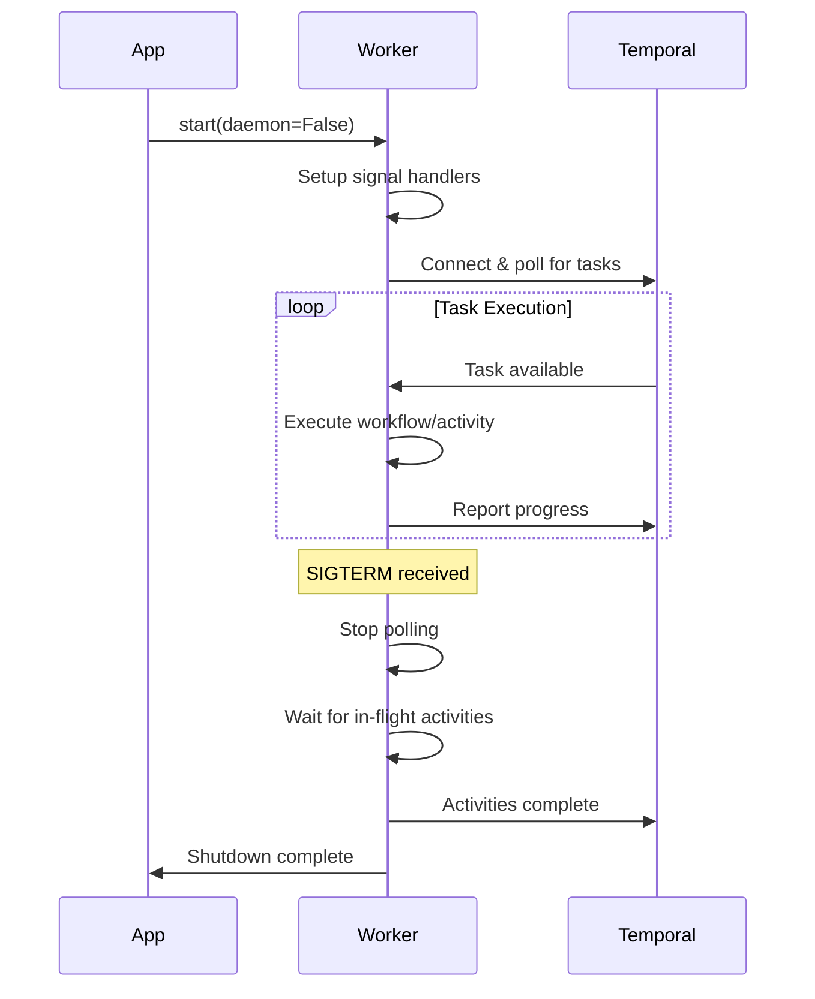

## Overview

The `Worker` class manages Temporal workflow workers, handling the execution of workflows and activities with support for graceful shutdown, concurrent execution limits, and custom module sandboxing.

<Note>
  Workers poll Temporal for tasks and execute workflow and activity code. In production, you typically run workers separately from API servers for better scalability.
</Note>

## Key Features

- **Graceful Shutdown**: Responds to SIGTERM/SIGINT signals, allowing in-flight activities to complete
- **Concurrency Control**: Configurable maximum concurrent activities
- **Custom Executors**: Support for custom thread pool executors
- **Module Sandboxing**: Control which modules are available in workflow execution
- **Daemon Mode**: Run workers in background threads for local development

## Initialization

```python
from application_sdk.worker import Worker
from application_sdk.clients.workflow import WorkflowClient
from concurrent.futures import ThreadPoolExecutor

worker = Worker(
    workflow_client=workflow_client,
    workflow_activities=[activity1, activity2],
    workflow_classes=[MyWorkflow],
    passthrough_modules=["my_app", "pandas"],
    max_concurrent_activities=10,
    activity_executor=ThreadPoolExecutor(max_workers=10)
)
```

### Constructor Parameters

<ParamField path="workflow_client" type="WorkflowClient" required>
  Client for interacting with Temporal. Provides connection details and task queue configuration.
</ParamField>

<ParamField path="workflow_activities" type="Sequence[CallableType]" default="[]">
  List of activity functions that this worker can execute.
  
  ```python
  workflow_activities = [
      activities.extract_data,
      activities.transform_data,
      activities.load_data
  ]
  ```
</ParamField>

<ParamField path="workflow_classes" type="Sequence[ClassType]" default="[]">
  List of workflow classes that this worker can execute.
  
  ```python
  workflow_classes = [DataPipelineWorkflow, ValidationWorkflow]
  ```
</ParamField>

<ParamField path="passthrough_modules" type="List[str]" default="[]">
  Additional Python modules to make available in the workflow sandbox.
  
  Default modules always available: `["application_sdk", "pandas", "os", "app"]`
  
  ```python
  passthrough_modules = ["my_app", "numpy", "requests"]
  ```
</ParamField>

<ParamField path="max_concurrent_activities" type="int" default="MAX_CONCURRENT_ACTIVITIES">
  Maximum number of activities that can run concurrently.
  
  Set to `None` for no limit. Configurable via `MAX_CONCURRENT_ACTIVITIES` environment variable.
</ParamField>

<ParamField path="activity_executor" type="ThreadPoolExecutor" default="None">
  Custom thread pool executor for running activities.
  
  If not provided, a default `ThreadPoolExecutor` with `max_concurrent_activities` workers is created.
  
  ```python
  from concurrent.futures import ThreadPoolExecutor
  
  executor = ThreadPoolExecutor(
      max_workers=20,
      thread_name_prefix="activity-"
  )
  worker = Worker(activity_executor=executor)
  ```
</ParamField>

## Starting the Worker

### Production Mode

Run the worker in the foreground (non-daemon mode). This is the standard mode for production worker pods.

```python
await worker.start(daemon=False)
```

<Tip>
  In production, use `daemon=False` so the worker runs in the main thread and responds to shutdown signals.
</Tip>

### Development Mode

Run the worker in daemon mode for local development. This starts the worker in a background thread.

```python
await worker.start(daemon=True)
```

<Warning>
  Daemon mode is only recommended for local development. Production deployments should use `daemon=False`.
</Warning>

### start() Method Parameters

<ParamField path="daemon" type="bool" default="True">
  Whether to run the worker in daemon mode (background thread).
  
  - `True`: Worker runs in background thread (local development)
  - `False`: Worker runs in foreground (production)
</ParamField>

## Graceful Shutdown

Workers support graceful shutdown to ensure in-flight activities complete before termination.

### How It Works

1. Worker receives SIGTERM or SIGINT signal
2. Worker stops polling for new tasks
3. In-flight activities continue executing
4. Worker waits for activities to complete (up to `GRACEFUL_SHUTDOWN_TIMEOUT_SECONDS`)
5. Worker exits when all activities finish or timeout is reached

```python
import signal
import asyncio

# Worker automatically handles SIGTERM/SIGINT
await worker.start(daemon=False)

# To manually trigger shutdown:
# kill -TERM <pid>
```

<Note>
  Graceful shutdown timeout is configurable via the `GRACEFUL_SHUTDOWN_TIMEOUT_SECONDS` environment variable (default: 30 seconds).
</Note>

### Platform Support

<Accordion title="Unix/Linux/macOS">
  Full signal handling support via asyncio event loop.
  
  Workers respond to:
  - `SIGTERM`: Graceful shutdown
  - `SIGINT`: Graceful shutdown (Ctrl+C)
</Accordion>

<Accordion title="Windows">
  Signal handling is **not supported** on Windows.
  
  <Warning>
    Workers on Windows will not respond to SIGTERM/SIGINT for graceful shutdown. They will continue running until the process is forcefully terminated.
    
    For production deployments, use Unix-based systems.
  </Warning>
</Accordion>

## Complete Worker Example

```python
import asyncio
from application_sdk.worker import Worker
from application_sdk.clients.workflow import WorkflowClient
from application_sdk.clients.utils import get_workflow_client
from concurrent.futures import ThreadPoolExecutor
from my_app.workflows import DataPipelineWorkflow
from my_app.activities import DataPipelineActivities

async def main():
    # Initialize workflow client
    workflow_client = get_workflow_client(application_name="data-pipeline")
    await workflow_client.load()
    
    # Get activities
    activities_instance = DataPipelineActivities()
    activities_list = DataPipelineWorkflow.get_activities(activities_instance)
    
    # Create custom executor
    executor = ThreadPoolExecutor(
        max_workers=15,
        thread_name_prefix="pipeline-activity-"
    )
    
    # Initialize worker
    worker = Worker(
        workflow_client=workflow_client,
        workflow_activities=activities_list,
        workflow_classes=[DataPipelineWorkflow],
        passthrough_modules=["my_app", "pandas", "numpy"],
        max_concurrent_activities=15,
        activity_executor=executor
    )
    
    # Start worker (blocks until shutdown)
    print("Starting worker...")
    await worker.start(daemon=False)
    print("Worker stopped")

if __name__ == "__main__":
    asyncio.run(main())
```

## Worker with Application

Typically, workers are managed by the `BaseApplication` class:

```python
from application_sdk.application import BaseApplication
from my_app.workflows import MyWorkflow
from my_app.activities import MyActivities

app = BaseApplication(name="my-app")

# Set up workflow and activities
await app.setup_workflow(
    workflow_and_activities_classes=[
        (MyWorkflow, MyActivities)
    ],
    passthrough_modules=["my_app"]
)

# Start based on APPLICATION_MODE
await app.start(
    workflow_class=MyWorkflow,
    ui_enabled=True
)
```

## Environment Variables

Workers respect these environment variables:

| Variable | Description | Default |
|----------|-------------|----------|
| `APPLICATION_MODE` | Deployment mode (`LOCAL`, `WORKER`, `SERVER`) | `LOCAL` |
| `MAX_CONCURRENT_ACTIVITIES` | Max concurrent activities | System default |
| `GRACEFUL_SHUTDOWN_TIMEOUT_SECONDS` | Shutdown timeout in seconds | `30` |
| `DEPLOYMENT_NAME` | Deployment identifier | - |

## Event Loop Optimization

The worker automatically selects the best event loop implementation:

### Unix/Linux/macOS

Uses `uvloop` for better performance (if installed):

```bash
pip install uvloop
```

### Windows

Uses `WindowsSelectorEventLoopPolicy` for compatibility.

<Tip>
  Install `uvloop` for production deployments on Linux for ~2-4x performance improvement:
  
  ```bash
  pip install uvloop
  ```
</Tip>

## Worker Lifecycle



## Best Practices

<Accordion title="Set Appropriate Concurrency Limits">
  Configure `max_concurrent_activities` based on your resource constraints.
  
  ```python
  # For CPU-intensive activities
  max_concurrent_activities = os.cpu_count()
  
  # For I/O-intensive activities
  max_concurrent_activities = os.cpu_count() * 4
  
  # For mixed workloads
  max_concurrent_activities = os.cpu_count() * 2
  ```
</Accordion>

<Accordion title="Use Dedicated Workers for Production">
  Run workers in separate pods/containers from API servers.
  
  ```bash
  # Worker pod
  export APPLICATION_MODE=WORKER
  python main.py
  
  # Server pod
  export APPLICATION_MODE=SERVER
  python main.py
  ```
</Accordion>

<Accordion title="Include Required Modules in Passthrough">
  Add all modules your workflows and activities need.
  
  ```python
  passthrough_modules = [
      "my_app",           # Your application code
      "pandas",           # Data processing
      "numpy",            # Numerical operations
      "requests",         # HTTP requests
      "sqlalchemy"        # Database access
  ]
  ```
</Accordion>

<Accordion title="Monitor Worker Health">
  Implement health checks and monitoring for production workers.
  
  ```python
  # Publish worker start event
  from application_sdk.services.eventstore import EventStore
  
  worker_event = Event(
      event_type="APPLICATION_EVENT",
      event_name="WORKER_START",
      data={
          "task_queue": workflow_client.worker_task_queue,
          "max_concurrent_activities": max_concurrent_activities
      }
  )
  await EventStore.publish_event(worker_event)
  ```
</Accordion>

<Accordion title="Handle Graceful Shutdown Properly">
  Ensure activities can complete within the shutdown timeout.
  
  ```python
  # Set appropriate timeout
  export GRACEFUL_SHUTDOWN_TIMEOUT_SECONDS=60
  
  # Design activities to be interruptible
  @activity.defn
  async def long_running_activity(args):
      for chunk in data_chunks:
          # Check for cancellation
          if activity.is_cancelled():
              logger.info("Activity cancelled, cleaning up...")
              await cleanup()
              raise activity.CancelledError()
          
          process_chunk(chunk)
          activity.heartbeat()
  ```
</Accordion>

## Instance Attributes

| Attribute | Type | Description |
|-----------|------|-------------|
| `workflow_client` | `Optional[WorkflowClient]` | Client for Temporal communication |
| `workflow_worker` | `Optional[TemporalWorker]` | Temporal worker instance |
| `workflow_activities` | `Sequence[CallableType]` | Registered activity functions |
| `workflow_classes` | `Sequence[ClassType]` | Registered workflow classes |
| `passthrough_modules` | `List[str]` | Modules available in workflow sandbox |
| `max_concurrent_activities` | `Optional[int]` | Max concurrent activity executions |
| `activity_executor` | `ThreadPoolExecutor` | Executor for running activities |

## Related Components

- [Application](/concepts/application) - Manages worker lifecycle
- [Workflows](/concepts/workflows) - Executed by workers
- [Activities](/concepts/activities) - Task implementations run by workers
- [Server](/concepts/server) - Triggers workflows that workers execute
